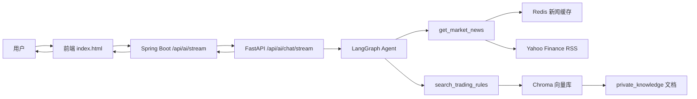

# 基于 LangChain / LangGraph 的 RAG 投研助手学习笔记

这份 README 不是简单的项目说明，而是按“从 0 到 1 搭建一套可运行的 RAG 系统”来写的学习文档。

目标是带你理解这套系统如何把下面几部分串起来：

- Python 端：用 `FastAPI + LangChain + LangGraph + Chroma + Embedding` 搭一个可检索、可工具调用、可流式输出的 RAG 服务
- Java 端：用 `Spring Boot + SseEmitter + HttpClient` 作为业务后端与 Python AI 服务之间的桥梁
- 前端：用 `fetch + ReadableStream + SSE 格式解析` 做实时流式展示，并把“思考过程”和“最终结论”区分开

如果你想学的是“如何自己搭一套类似架构”，这份 README 就是给你准备的。

---

## 1. 这套系统解决什么问题

这个项目里的 AI 助手不是单纯让大模型直接回答问题，而是让它按下面的方式工作：

1. 用户在网页输入一个股票相关问题
2. Java 后端收到请求后，把问题转发给 Python AI 服务
3. Python AI 服务不直接硬答，而是先让 Agent 判断要不要查工具
4. Agent 可以调用两个工具：
   - 查股票相关新闻
   - 查私有交易规则知识库
5. 工具返回结果后，Agent 再决定：
   - 还要不要继续查
   - 证据够不够
   - 是否可以输出最终结论
6. Python 把“思考摘要”和“最终答案”按流式格式返回
7. Java 再把 Python 的流转成前端能消费的 SSE
8. 浏览器实时渲染思考过程，并在最后显示完整结论

这个过程的核心思想是：

- 不让模型凭空回答
- 先检索、再分析、再输出
- 用状态图控制“继续查”还是“结束回答”
- 用流式输出提升交互体验

---

## 2. 这套系统的核心技术栈

### Python 端

- `FastAPI`
  - 用来暴露 HTTP API
  - 提供同步接口和流式接口
- `LangChain`
  - 提供工具定义、消息结构、Embedding 集成等基础能力
- `LangGraph`
  - 用状态图的方式构建 Agent 循环
  - 决定模型何时继续调用工具，何时停止
- `Chroma`
  - 本地向量数据库
  - 存储私有知识库切片后的向量
- `HuggingFaceEmbeddings`
  - 把文本转成向量
- `feedparser + BeautifulSoup`
  - 抓 Yahoo Finance RSS 新闻并做清洗
- `Redis`
  - 缓存新闻结果，减少重复抓取

### Java 端

- `Spring Boot`
  - 业务后端
- `RestTemplate`
  - 调 Python 的同步接口
- `java.net.http.HttpClient`
  - 调 Python 的流式接口
- `SseEmitter`
  - 把 Python 的 SSE 再转发给浏览器

### 前端

- 原生 `fetch`
  - 发起 AI 请求
- `ReadableStream + getReader()`
  - 按块读取流数据
- `TextDecoder`
  - 把二进制流解码成文本
- `details/summary`
  - 做“可展开的思考过程”

---

## 3. 项目中的 AI 相关目录

```text
ai_engine/
  final_api.py        # FastAPI 入口，定义 AI 与知识库接口
  rag_service.py      # LangGraph Agent 主逻辑
  rag_storage.py      # 私有知识库构建、切分、向量化、检索
  news_fetcher.py     # 新闻抓取与清洗

demo/src/main/java/com/project___10/demo/
  controller/AIController.java
  service/AIAssistantService.java
  service/AIAssistantServiceImpl.java

demo/src/main/resources/
  application.yml
  static/index.html   # 前端流式 AI 展示逻辑
```

---

## 4. 整体架构图



你可以把它理解成 3 层：

- 展示层：前端页面
- 网关层：Java 后端
- 智能层：Python RAG Agent

这样拆分的好处是：

- Java 继续负责你的主业务系统
- Python 专心负责 AI 推理和检索
- 前端不用直接依赖 Python 的内部细节

---

## 5. 一次完整问答是怎么流动的

以用户问“我现在是否应该继续持有 TSLA？”为例：

1. 前端调用 `/api/ai/stream`
2. Java `AIController` 接到请求
3. Java `AIAssistantServiceImpl` 再调用 Python `/api/ai/chat/stream`
4. Python `final_api.py` 收到请求，把问题交给 `MarketRAGService.stream_events()`
5. `rag_service.py` 启动 LangGraph 状态图
6. 模型先判断要不要调用工具
7. 如果要查新闻，就调用 `get_market_news`
8. 如果要查规则，就调用 `search_trading_rules`
9. 工具结果回到 Agent，Agent 再继续下一轮判断
10. 当证据足够，Agent 停止工具调用
11. Python 先输出思考摘要，再输出最终结论
12. Java 逐条读取 Python 的 SSE 数据并转发给浏览器
13. 前端流式解析，最终把完整答案展示出来

---

## 6. 从 0 开始，如何一步步搭这套 RAG 系统

这一节最重要。你以后自己搭系统时，可以直接按这个顺序来。

### 第一步：先确定“检索什么”

做 RAG 前，不要先写 Agent，而是先想清楚：

- 你的外部知识是什么
- 它们从哪里来
- 是结构化还是非结构化

这个项目里有两类知识：

1. 实时市场新闻
   - 来源：Yahoo Finance RSS
   - 特点：变化快，适合做“外部实时上下文”
2. 私有交易规则
   - 来源：你自己整理的 txt/md/pdf 文档
   - 特点：较稳定，适合做“长期规则约束”

也就是说，这套 RAG 不是只检索一种数据，而是“新闻 + 私有知识”双检索。

### 第二步：实现私有知识库的导入和向量化

这部分在 `ai_engine/rag_storage.py`。

它做了 5 件事：

1. 读取本地文档
   - `load_private_documents()`
   - 支持 `txt / md / pdf`
2. 清洗文本
   - `clean_text()`
3. 文本切块
   - `split_documents()`
   - 使用 `RecursiveCharacterTextSplitter`
4. 文本向量化
   - `get_embeddings()`
   - 使用 `HuggingFaceEmbeddings(model_name="all-MiniLM-L6-v2")`
5. 写入 Chroma
   - `build_private_knowledge_base()`

为什么要切块？

因为大文档不能整篇直接拿去检索。必须先切成较小片段，再把每个片段向量化。这样检索时返回的是“最相关的片段”，不是整本文件。

这里的关键参数：

- `chunk_size=900`
- `chunk_overlap=150`

意思是：

- 每块大约 900 个字符
- 相邻块之间保留 150 个字符重叠

这样做能减少切块边界造成的信息断裂。

### 第三步：实现检索器

仍然在 `rag_storage.py`。

核心函数是：

- `search_private_knowledge(query, k=4)`

它做的事情是：

1. 读取 Chroma 向量库
2. 创建 retriever
3. 用用户问题做向量检索
4. 返回最相关的 `Document`

这里用了：

- `search_type="mmr"`

MMR 的好处是：

- 不只选最像的片段
- 也尽量避免结果过于重复

所以比单纯相似度排序更适合问答场景。

### 第四步：实现外部新闻工具

这部分主要在 `news_fetcher.py` 和 `rag_service.py`。

`news_fetcher.py` 的职责很单纯：

- 拼接 Yahoo Finance RSS 地址
- 用 `feedparser` 拉取新闻
- 用 `BeautifulSoup` 清理摘要里的 HTML
- 返回统一结构的新闻列表

关键函数：

- `_clean_summary()`
- `fetch_yahoo_news()`

这里还做了一个很实用的小细节：

- 用 `quote(symbol, safe=".")` 做 URL 编码

这样可以避免股票代码或错误参数中出现特殊字符时直接导致 URL 非法。

### 第五步：把检索能力封装成 LangChain Tool

这一步是从“普通函数”升级到“Agent 可调用工具”的关键。

在 `rag_service.py` 中：

- `_build_news_tool()`
- `_build_rules_tool()`

里面使用了：

```python
@tool("get_market_news")
@tool("search_trading_rules")
```

为什么要变成 Tool？

因为大模型不会主动调用普通 Python 函数，只有被包装成 LangChain Tool，模型才知道：

- 这个工具叫什么
- 输入参数是什么
- 什么时候可以调用它

也就是说：

- 普通函数：你自己调用
- Tool：模型在推理过程中调用

### 第六步：设计 Agent 的状态

在 `rag_service.py` 中定义了：

```python
class MarketAgentState(TypedDict):
    messages: Annotated[list[BaseMessage], add_messages]
    symbol: str
```

这里的状态图状态只保留两项：

- `messages`
  - 保存当前对话轮次中的消息
  - 包括用户消息、模型回复、工具返回结果
- `symbol`
  - 当前股票代码

为什么状态里一定要有 `messages`？

因为 LangGraph 的核心就是“带状态的多轮执行”。每轮工具调用后，新的消息都会追加回状态，下一轮模型推理再继续基于这些消息判断。

### 第七步：用 LangGraph 搭建循环 Agent

这部分是整个系统最核心的地方。

在 `rag_service.py` 中：

```python
builder = StateGraph(MarketAgentState)
builder.add_node("agent", self._call_model)
builder.add_node("tools", self.tool_node)
builder.add_edge(START, "agent")
builder.add_conditional_edges("agent", tools_condition, {...})
builder.add_edge("tools", "agent")
```

这个图可以理解为：

1. 先进入 `agent`
2. `agent` 判断要不要调用工具
3. 如果要调用，就跳到 `tools`
4. 工具执行完，再回到 `agent`
5. 循环直到模型不再调用工具
6. 最后结束

这正是你想要的“可循环执行的 agent 状态图”。

为什么不直接用一次 `retrieve -> prompt -> answer`？

因为那样只能固定检索一次，而你现在需要的是：

- 模型先判断该查新闻还是查规则
- 查完之后再决定要不要继续查
- 不够再继续迭代

这就是 LangGraph 比简单链式调用更适合你的原因。

### 第八步：让模型学会“什么时候查工具”

在 `rag_service.py` 里，模型对象是：

```python
self.llm = ChatOpenAI(
    model="deepseek-chat",
    api_key=os.environ.get("DEEPSEEK_API_KEY_FOR_Ttth"),
    base_url="https://api.deepseek.com",
    timeout=120.0,
    temperature=0,
)
```

然后再做：

```python
self.llm_with_tools = self.llm.bind_tools(self.tools)
```

这一步非常关键。

`bind_tools()` 的作用是：

- 把工具定义暴露给模型
- 模型每一轮回答时可以选择：
  - 直接回答
  - 调用某个工具

再配合 system prompt，模型就会按你的要求工作。

### 第九步：用 Prompt 约束模型输出结构

`rag_service.py` 中的 `SYSTEM_PROMPT` 用来告诉模型：

- 要优先使用工具
- 新闻问题优先查新闻
- 规则问题优先查知识库
- 不足时不能编造
- 最终回答必须按固定结构输出
- 不暴露原始内部推理

这个 prompt 的设计思路很重要：

不是让模型“自由发挥”，而是让它被约束在一个稳定、可控的工作流里。

另外还特意加了一条：

- `get_market_news` 只能接收单个股票代码

这是因为我们实际运行中踩过坑：模型把整串关键词传给新闻工具，导致 RSS URL 出错。这个经验很值得记住：

- Tool 参数一定要加约束
- 不能完全相信模型会自动传对参数

### 第十步：实现流式输出

这部分在 `rag_service.py` 的 `stream_events()`。

它不是普通返回字符串，而是 `yield` 一个个事件。

目前事件类型有：

- `thinking`
- `final`
- `done`
- `error`

工作方式是：

1. 工具执行时，用 `get_stream_writer()` 发 `thinking`
2. Agent 循环结束后，再统一发最终 `final`
3. 最后发 `done`

这意味着现在的交互节奏是：

- 先看到“思考过程”
- 最后一次性看到完整结论

这是你后来明确想要的模式。

---

## 7. Python 端每个文件的作用

### 7.1 `ai_engine/final_api.py`

它是 Python 服务入口，负责：

- 定义 FastAPI 应用
- 处理跨域
- 初始化 Redis
- 初始化 `MarketRAGService`
- 提供知识库接口
- 提供 AI 同步接口
- 提供 AI 流式接口
- 处理请求校验异常

主要接口：

- `GET /api/news/{symbol}`
  - 获取新闻
- `GET /api/knowledge/status`
  - 查看知识库状态
- `POST /api/knowledge/rebuild`
  - 重建知识库
- `POST /api/knowledge/clear`
  - 清空知识库
- `POST /api/ai/chat`
  - 同步回答
- `POST /api/ai/chat/stream`
  - 流式回答

重点函数：

- `ChatReq`
  - 定义 AI 请求体
  - 同时兼容 `question` 和 `message`
- `_sse_payload()`
  - 把 Python 字典转成 SSE 字符串
- `validation_exception_handler()`
  - 在请求体不合法时打印详细日志，方便定位 422

### 7.2 `ai_engine/rag_service.py`

这是整个 AI 核心。

主要职责：

- 定义 system prompt
- 定义 agent 状态
- 定义工具
- 构建 LangGraph
- 调模型
- 组织流式事件

重点函数：

- `_build_news_tool()`
  - 构建新闻工具
- `_build_rules_tool()`
  - 构建规则检索工具
- `_build_graph()`
  - 构建 Agent 状态图
- `_get_news_items()`
  - 查 Redis，没有则查外部新闻
- `_call_model()`
  - 执行模型一轮推理
- `stream_events()`
  - 输出思考摘要和最终答案
- `analyze()`
  - 提供同步接口使用的聚合逻辑

### 7.3 `ai_engine/rag_storage.py`

这是知识库模块。

主要职责：

- 读取本地文档
- 清洗文本
- 切分文档
- 向量化
- 存入 Chroma
- 检索知识

重点函数：

- `load_private_documents()`
- `split_documents()`
- `get_embeddings()`
- `build_private_knowledge_base()`
- `get_vector_store()`
- `search_private_knowledge()`
- `get_private_knowledge_status()`

### 7.4 `ai_engine/news_fetcher.py`

这是实时新闻模块。

主要职责：

- 读取 Yahoo Finance RSS
- 清洗 HTML 摘要
- 返回统一结构

重点函数：

- `_clean_summary()`
- `fetch_yahoo_news()`

---

## 8. 为什么说这套系统是“RAG + Agent”，不是普通 RAG

普通 RAG 往往是：

1. 用户提问
2. 检索一次
3. 把结果塞进 prompt
4. 模型回答

而你现在这套更像 Agentic RAG：

1. 用户提问
2. 模型判断要查什么
3. 调工具
4. 拿到结果后再判断要不要继续查
5. 多轮循环
6. 最后才输出结论

所以它不只是“检索增强”，而是“可决策、可多轮工具调用”的检索系统。

这类架构更适合：

- 多信息源
- 有规则约束
- 检索路径不固定
- 需要逐步收集证据

---

## 9. Java 端是怎么和 Python 通信的

### 9.1 `AIController.java`

它是 Java 暴露给前端的 AI 接口层。

有两个接口：

- `/api/ai/analyze`
  - 同步
- `/api/ai/stream`
  - 流式

这层的作用很简单：

- 接住浏览器请求
- 调用 `AIAssistantService`

### 9.2 `AIAssistantServiceImpl.java`

这是 Java 和 Python 通信的真正实现层。

#### 同步模式

`getAIAnalysis()` 的做法：

1. 构造 JSON 请求体
2. 用 `RestTemplate.postForEntity()` 调 Python `/api/ai/chat`
3. 解析响应里的 `reply`

#### 流式模式

`streamAIAnalysis()` 的做法：

1. 构造 JSON 请求体
2. 用 `HttpClient` 请求 Python `/api/ai/chat/stream`
3. 按行读取 Python 返回的数据流
4. 每遇到一条 `data:` 开头的 SSE 消息，就解析成 JSON
5. 再通过 `SseEmitter` 发给前端

这相当于：

- Python -> Java：一层 SSE
- Java -> 浏览器：再转一层 SSE

#### 为什么要强制 `HTTP/1.1`

代码里这里很关键：

```java
HttpClient.newBuilder().version(Version.HTTP_1_1)
```

这是因为我们实际遇到过：

- `Unsupported upgrade request`
- `422 body missing`

原因是 Java 默认某些情况下会尝试升级连接，Uvicorn 不接受，导致请求体异常。

强制 `HTTP/1.1` 后就稳定了。

---

## 10. 前端是怎么实现流式输出的

前端相关逻辑在：

- `demo/src/main/resources/static/index.html`

关键思路不是 EventSource，而是：

- 用 `fetch()` 发 POST
- 再直接读取 `response.body`

因为这里你需要：

- 自定义 POST body
- 流式接收响应

### 前端流式步骤

1. `fetch('/api/ai/stream', { method: 'POST', body: ... })`
2. `response.body.getReader()`
3. `reader.read()` 持续取数据块
4. 用 `TextDecoder` 解码
5. 按 `\n\n` 切分 SSE 消息
6. 找 `data:` 行
7. `JSON.parse(payload)`
8. 根据 `event.type` 更新页面

### 当前支持的事件

- `thinking`
  - 追加到思考过程区域
- `final`
  - 更新最终答案区域
- `error`
  - 展示错误信息
- `done`
  - 标记流程结束

### 为什么思考区域做成 `details`

因为你后面希望：

- 默认只看结论
- 需要时再展开思考过程

所以现在前端用了原生 HTML：

```html
<details>
  <summary>查看思考过程</summary>
  ...
</details>
```

它的好处是：

- 原生支持展开收起
- 不需要额外 JS 状态管理
- 语义清晰

---

## 11. SSE 数据格式是怎么约定的

Python 端输出的是标准 SSE 文本：

```text
data: {"type":"thinking","content":"正在查询 TSLA 的最新市场新闻..."}

data: {"type":"thinking","content":"已获取 5 条相关新闻。"}

data: {"type":"final","content":"1. 市场解读 ..."}

data: {"type":"done","content":""}
```

也就是说，每条消息都要：

- 以 `data:` 开头
- 以空行结尾

浏览器端按这个格式切分就可以。

---

## 12. 这套系统里最值得学习的几个设计点

### 12.1 请求兼容层

`ChatReq` 中兼容了：

- `question`
- `message`

这是一个非常实用的工程化细节。

因为前端、Java、Python 多端协作时，字段名很容易不一致。给 Python 入口加一层兼容，比要求所有调用方同时严格改完更稳。

### 12.2 不暴露原始 Chain-of-Thought

系统展示的是：

- 工具状态
- 可见推理摘要

而不是原始内部推理。

这是更稳妥的做法，原因有两个：

1. 更适合产品展示
2. 更符合安全和稳定性要求

### 12.3 工具参数规范化

`_normalize_ticker()` 是一个很好的例子。

不要假设模型一定会传对工具参数。应该在工具入口再做一次清洗和兜底。

### 12.4 新闻缓存

新闻先查 Redis，再查 RSS，减少重复请求。

这个思想以后也能扩展到：

- 外部 API 响应缓存
- 检索结果缓存
- Agent 中间结果缓存

---

## 13. 从学习角度，你可以重点掌握哪些函数

如果你准备逐个吃透，我建议按这个顺序看：

### 第一阶段：先理解知识库

1. `build_private_knowledge_base()`
2. `split_documents()`
3. `search_private_knowledge()`

### 第二阶段：再理解 Agent

1. `_build_news_tool()`
2. `_build_rules_tool()`
3. `_build_graph()`
4. `_call_model()`
5. `stream_events()`

### 第三阶段：再理解接口层

1. `ChatReq`
2. `chat_with_rag_stream()`
3. `streamAIAnalysis()`
4. 前端 `sendMessage()`

这样顺序最好，因为：

- 先懂“数据从哪来”
- 再懂“模型怎么调工具”
- 最后懂“怎么流到页面上”

---

## 14. 你可以怎么从 0 自己复现一遍

如果你要训练自己独立搭建，建议按下面顺序手写一遍：

1. 先只做一个 `rag_storage.py`
   - 支持 txt/md
   - 能导入、切块、向量化、检索
2. 再做一个最小 `news_fetcher.py`
   - 能查新闻并返回统一结构
3. 再做一个最小 `rag_service.py`
   - 先别上 LangGraph
   - 只做“查一次规则 + 回答”
4. 然后再升级成 Tool
   - 用 `@tool`
5. 再升级成 LangGraph
   - `agent -> tools -> agent`
6. 再加 `stream_events()`
   - 先只流 thinking
   - 再流 final
7. 再加 `FastAPI`
   - 同步接口
   - 流式接口
8. 再接 Java 中转
9. 最后接前端

这样学最扎实，因为每一步你都知道自己在加什么能力。

---

## 15. 常见问题与踩坑记录

### 15.1 为什么会返回 422

原因通常有两个：

1. 请求体字段名不一致
   - 前端传 `message`
   - Python 要 `question`
2. 请求体根本没传进去

这里已经通过 `ChatReq` 做了兼容，并加了 `validation_exception_handler()` 打日志。

### 15.2 为什么会出现 `Unsupported upgrade request`

这是 Java 调 Python 流式接口时的协议问题。

解决方式：

- Java `HttpClient` 强制 `HTTP/1.1`

### 15.3 为什么新闻查询会因为 URL 报错

因为模型有时会把：

- 股票代码
- 关键词
- 解释性短语

一起传进新闻工具。

解决方式：

1. prompt 里约束工具参数
2. `_normalize_ticker()` 提取合法 ticker
3. `quote()` 做 URL 编码

### 15.4 为什么不直接把模型的思考过程原样输出

因为产品上更适合展示：

- 过程摘要
- 工具调用状态

而不是原始内部推理。

---

## 16. 如何启动这套系统

### Python 端

在 `ai_engine` 目录下启动：

```bash
uvicorn final_api:app --reload --port 5000
```

你至少需要准备：

- Redis
- Python 虚拟环境
- `DEEPSEEK_API_KEY_FOR_Ttth`

### Java 端

启动 Spring Boot 项目，确保 `application.yml` 中：

```yaml
serviceurl: http://localhost:5000/api/ai/chat
serviceurlstream: http://localhost:5000/api/ai/chat/stream
```

这样 Java 才能找到 Python。

### 知识库

把你的私有规则文档放进：

```text
ai_engine/private_knowledge/
```

然后调用：

- `POST /api/knowledge/rebuild`

来重建向量库。

---

## 17. 以后你还能往哪里升级

这套系统已经能跑，但还能继续进化。

你后续可以继续做：

- 把新闻工具扩展成多数据源
  - Yahoo + SEC + 财报摘要
- 给工具加参数 schema 校验
- 给 Agent 增加最大循环次数
- 给每轮工具调用加日志追踪 ID
- 给知识库检索加重排序模型
- 把“思考过程”改成更精细的步骤卡片
- 把流式输出从原生 JS 升级成专门的聊天 UI 组件
- 给 Java 和 Python 增加统一 trace id，方便排查问题

---

## 18. 这套系统最核心的一句话总结

你现在做的，不是一个“让大模型回答问题的小功能”，而是一套：

- 有知识库
- 有工具
- 有状态图
- 有多轮决策
- 有流式展示
- 有 Java/Python 双端协作

的 Agentic RAG 系统。

如果你把这份 README 里的每一步都自己重新敲一遍，你就不只是“会用 LangChain”，而是真的开始理解：

- RAG 怎么搭
- Agent 怎么循环
- 流式输出怎么做
- 多端服务怎么串

这也是你后面继续往更复杂 AI 系统走的基础。
